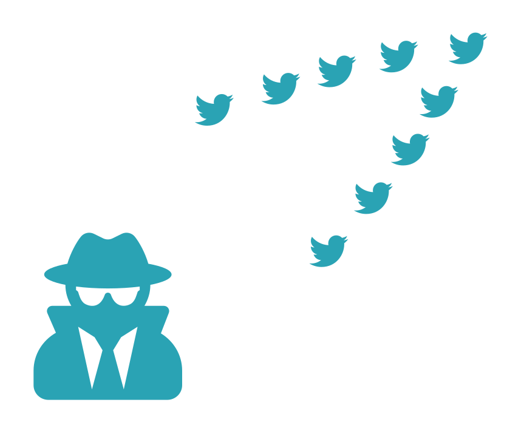

```{r setup, include=F, echo=F}
library(RefManageR)
library(here)

BibOptions(check.entries = F,
           bib.style = 'authoryear',
           cite.style = 'authoryear',
           style = 'markdown',
           hyperlink = F,
           dashed = F,
           max.names = 1,
           longnamesfirst = F)

bib <- ReadBib(here('docs', 'reference.bib'),
               check = F)
```
class: titleSlide

<script src="https://kit.fontawesome.com/43b8869272.js" crossorigin="anonymous">
</script>
 
<div>
    <h1 style="padding-right: 100px; margin-right: 0px; color: var(--background); background: white; padding-top: 50px; padding-bottom: 50px; padding-left: 100px;">
        Istraživačka etika i veliki skupovi podataka
    </h1>
</div>

## Etički kolokvij

### Denis Vlašiček

<span, style='font-family: Comfortaa; font-size: 14pt;'>
    <i class="fab fa-github"></i> vdeni.github.io/phd-eticki-kolokvij
</span>

---

class: sectionSlide, animated, slideInLeft

# Big data

---

class: animated, slideInLeft


<ul class='pull-right' style='padding-top: 90pt'>

<li>veliki skupovi podataka</li>

.whiteout[
<li>kontinuirano se mijenjaju</li>
 
<li>često nestrukturirani</li>

<li>ograničena mogućnost kontrole kvalitete</li>
]
</ul>

---

count: false


<ul class='pull-right' style='padding-top: 90pt'>
<li>veliki skupovi podataka</li>

<li>kontinuirano se mijenjaju</li>
 
--

<li>često nestrukturirani</li>

--

<li>ograničena mogućnost kontrole kvalitete</li>
</ul>

???

- kontinuirano dodavanje novih unosa, ali moguće i dodavanje novih varijabli
(ali i njihovo uklanjanje)

- nestrukturirani u smislu da nije uvijek lijepi pravokutnik na kakve smo mi
navikli

- podaci s društvenih mreža, ali i registri, velike baze fotografija

---

class: sectionSlide, animated, slideInLeft

# Prikupljanje

---

class: animated, slideInLeft

## Specifičnosti

<hr></hr>


<ul class='pull-left' style='padding-top: 20px;'>

<li>bogatstvo informacija</li>

.whiteout[
<li>rizik od identifikacije?</li>

<li>informirani pristanak?</li>

<li>povezivanje s drugim izvorima</li>

<li>odobrenje etičkog povjerenstva?</li>
]
</ul>

---

count: false

## Specifičnosti

<hr></hr>


<ul class='pull-left' style='padding-top: 20px;'>

<li>bogatstvo informacija</li>

<li>rizik od identifikacije?</li>

--

<li>povezivanje s drugim izvorima</li>

--

<li>informirani pristanak?</li>

--

<li>odobrenje etičkog povjerenstva?</li>
</ul>

---

class: animated, slideInLeft

## Privatnost

<hr></hr>



<ul class='pull-left' style='padding-top: 70px;'>

<li>što je privatnost na društvenim mrežama?</li>

.whiteout[
<li>privatni ili javni prostori?</li>

<li>očekivanja privatnosti od strane korisnika?</li>
]

</ul>

---

count: false

## Privatnost

<hr></hr>


<ul class='pull-left' style='padding-top: 70px;'>

<li>što je privatnost na društvenim mrežama?</li>

<li>privatni ili javni prostori?</li>

--

<li>očekivanja privatnosti od strane korisnika?</li>

</ul>

---

class: sectionSlide, animated, slideInLeft

# Uporaba

---

class: animated, slideInLeft

<blockquote style='margin-top: 130px'>
And, while some language technology is genuinely designed to benefit
marginalized communities, most language technology is built to serve the needs
of those who already have the most privilege in society. [...] [T]he harms that
follow are most likely to fall on marginalized populations who, even in rich
nations, are most likely to experience environmental racism.
`r Citep(bib, 'bender2021dangers', after = '; p. 4')`
</blockquote>


<blockquote style='background: #ffffff'>
Poor people are more likely to have bad credit and live in high-crime
neighborhoods, surrounded by poor other people. [The algorithm then] showers
them with predatory ads for subprime loans [...]. It sends more police to
arrest them, and when they're convicted, it sentences them to longer terms.
</blockquote>

???

5t CO2e po osobi u godinu dana; 284t CO2e za treniranje jednog modela

---

count: false

<blockquote style='margin-top: 130px'>
And, while some language technology is genuinely designed to benefit
marginalized communities, most language technology is built to serve the needs
of those who already have the most privilege in society. [...] [T]he harms that
follow are most likely to fall on marginalized populations who, even in rich
nations, are most likely to experience environmental racism.
`r Citep(bib, 'bender2021dangers', after = '; p. 4')`
</blockquote>

<blockquote>
Poor people are more likely to have bad credit and live in high-crime
neighborhoods, surrounded by other poor people. [The algorithm then] showers
them with predatory ads for subprime loans [...]. It sends more police to
arrest them, and when they're convicted, it sentences them to longer terms.
`r Citep(bib, 'o2016weapons', after = '; pp. 199-200')`
</blockquote>

---

class: sectionSlide, animated, slideInLeft

# Dijeljenje i pohrana

---

class: animated, slideInLeft


<ul class='pull-right' style='margin-top: 180px'>
<li>anonimnost?</li>

.whiteout[
<li>dopušteno dijeljenje?</li>

<li>reproducibilnost!</li>
]
</ul>

---


<ul class='pull-right' style='margin-top: 180px'>
<li>anonimnost?</li>

<li>dopušteno dijeljenje?</li>

--

<li>reproducibilnost!</li>
</ul>

---

class: animated, slideInLeft

## Reference i resursi

```{r printRefs, results='asis', echo=F}
NoCite(bib, c('10.1371/journal.pcbi.1005399', 'bishop2017big',
              'cessda_training_team_2020_3820473'))
PrintBibliography(bib)
```

Ilustracije nastale na temelju [FontAwesome](https://fontawesome.com/) ikona
koje su pokrivene CC-BY 4.0 [licencom](https://fontawesome.com/license).
